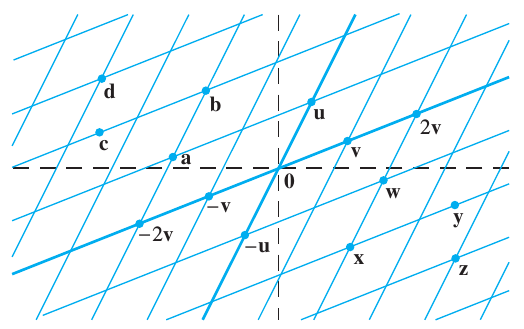
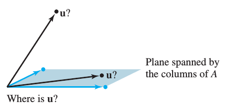

## HW 2: 

**Due Friday, February 2, 9am**  
**Section 1.3.** 2, 6, 8, 10, 14, (19), (21), 24, 26;  
**Section 1.4.** 2, 10, (13), 14, 18, 20, 22, (27), (29), (31), 32.   
(Numbers in parentheses are recommended exercises; please do not submit solutions to these exercises.)

------------------------------

### Section 1.3
#### Exercises 2, 6, 8, 10, 14, (19), (21), 24, 26

**1.3.2.**
Compute $\mathbf{u} + \mathbf{v}$ and
$\mathbf{u} - 2 \mathbf{v}$, where
$\mathbf{u} = \left[\begin{array}{r} 3 \\ 2 \end{array}\right]
\text{ and }
\mathbf{v} = \left[\begin{array}{r} 2 \\ -1 \end{array}\right]$.

--------------------------------------------------------

**1.3.6.**
Write a system of equations that is equivalent
to the vector equation,
$$
x_1\left[\begin{array}{r} -2 \\ 3 \end{array}\right] +
x_2\left[\begin{array}{r} 8 \\ 5 \end{array}\right] +
x_3\left[\begin{array}{r} 1 \\ -6 \end{array}\right] =
\left[\begin{array}{r} 0 \\ 0 \end{array}\right]
$$

--------------------------------------------------------

**1.3.8.**   Answer parts (a) and (b).

**(a)** Using the accompanying figure, write each of the vectors
 $\mathbf{w}$, $\mathbf{x}$, $\mathbf{y}$, and $\mathbf{z}$
 as a linear combination of $\mathbf{u}$ and $\mathbf{v}$.

**(b)** Is every vector in $\mathbb{R}^2$ a linear combination of
 $\mathbf{u}$ and $\mathbf{v}$?

--------------------------------------------------------

**1.3.10.** Write a vector equation that is equivalent to
the following system of equations:

$$\begin{align*}
4x_1 + x_2 + 3x_3 &= 9\\
x_1 - 7x_2 - 2x_3 &= 2\\
8x_1 + 6x_2 - 5x_3 &= 15
\end{align*}$$

--------------------------------------------------------

**1.3.14.**
Determine if $\mathbf{b}$ is a linear combination of
the vectors formed from the columns of the matrix $A$, where
$$A = \left[\begin{array}{r}
1 & -2 & -6  \\
0 & 3 & 7 \\
1 & -2 & 5
\end{array}\right]
\; \text{ and } \;
\mathbf{b} =
\left[\begin{array}{r}
11  \\ -5 \\ 9
\end{array}\right].$$

--------------------------------------------------------

**(1.3.19)**
Give a geometric description of $\operatorname{Span}\{\mathbf{v}_1, \mathbf{v}_2 \}$
for the vectors
$$\mathbf{v}_1 =
\left[\begin{array}{r}
8  \\ 2 \\ -6
\end{array}\right]
\; \text{ and } \;
\mathbf{v}_2 =
\left[\begin{array}{r}
12  \\ 3 \\ -9
\end{array}\right].$$

--------------------------------------------------------

**(1.3.21)**
 Let
$\mathbf{u} = \left[\begin{array}{r} 2  \\ -1 \end{array}\right]$
and
$\mathbf{v} = \left[\begin{array}{r} 2  \\ 1 \end{array}\right]$.
Show that
$\left[\begin{array}{r} h  \\ k \end{array}\right]$
is in
$\operatorname{Span}\{\mathbf{u}, \mathbf{v} \}$ for all $h$ and $k$.

--------------------------------------------------------

**1.3.24.**
Mark each statement True or False. Justify each answer.

**a.** Any list of five real numbers is a vector in $\mathbb{R}^5$.

**b.** The vector $\mathbf{u}$ results when a vector $\mathbf{u} - \mathbf{v}$
   is added to the vector $\mathbf{v}$.

**c.** The weights $c_1, \dots, c_p$ in a linear combination
   $c_1\mathbf{v}_1 + \cdots + c_p \mathbf{v}_p$ cannot all be zero.

**d.** When $\mathbf{u}$ and $\mathbf{v}$ are nonzero vectors,
    $\operatorname{Span}\{\mathbf{u}, \mathbf{v}\}$ contains
   the line passing through $\mathbf{u}$ and the origin.

**e.** Asking whether the linear system corresponding to
   an augmented matrix $[\mathbf{a}_1, \mathbf{a}_2, \mathbf{a}_3, \mathbf{b}]$
   has a solution amounts to asking whether $\mathbf{b}$ is in
   $\operatorname{Span}\{\mathbf{a}_1, \mathbf{a}_2, \mathbf{a}_3\}$.

--------------------------------------------------------

**1.3.26.**

Let $A  = \left[\begin{array}{r}
2& 0& 6\\
-1 &8 &5\\
1 &-2& 1
\end{array}\right]$, let
$\mathbf{b} =  
\left[\begin{array}{r}
10\\3\\3
\end{array}\right]$, and let $W$ be
the set of all linear combinations of the columns of $A$.
Answer (a) and (b).

**(a)** Is $\mathbf{b}$ in $W$?

**(b)** Show that the third column of $A$ is in $W$.

--------------------------------------------------------

### Section 1.4
#### Exercises 2, 10, (13), 14, 18, 20, 22, (27), (29), (31), 32  

**1.4.2.**
Compute the product
$\left[\begin{array}{r}
2\\6\\-1
\end{array}\right]
\left[\begin{array}{r}
5\\-1
\end{array}\right]$.   If the
 product is undefined, explain why.

--------------------------------------------------------

**1.4.10.** Write the following system first as a vector equation
and then as a matrix equation:
$$\begin{align*}
8x_1 - x_2 &=4\\
5x_1 +4x_2 &=1\\
x_1 - 3x_2 &=2
\end{align*}$$

--------------------------------------------------------

**(1.4.13)**
Let $\mathbf{u} = \left[\begin{array}{r}
0 \\4\\ 4
\end{array} \right]$
and $A =
\left[\begin{array}{r}
 3 & -5\\
-2 & 6\\
 1 & 1\end{array}\right]$. Is $\mathbf{u}$ in the plane spanned by the columns
of $A$? (See the figure below.)  Why or why not?

**1.4.14.**
Let $\mathbf{u} = \left[\begin{array}{r}
2 \\-3\\ 2
\end{array} \right]$
and $A =
\left[\begin{array}{r}
5 & 8 &  7\\
0 & 1 & -1\\
1 & 3 &  0
\end{array}\right]$.
Is $\mathbf{u}$ in the plane spanned by the columns
of $A$? (See the figure above.)  Why or why not?

--------------------------------------------------------
Exercises 18 and 20 refer to the matrix $B$ below. Make
appropriate calculations that justify your answers and mention an
appropriate theorem.

$$ B=
\left[\begin{array}{r}
1 & 3 & -2 & 2\\
0 & 1 & 1& -5\\
1 & 2 & -3& 7\\
-2 & -8 & 2& -1
\end{array}\right]$$

**1.4.18.**
Do the columns of $B$ span $\mathbb{R}^4$?
Does the equation $B\mathbf{x} = \mathbf{y}$
have a solution for each $\mathbf{y}$ in $\mathbb{R}^4$?

**1.4.20.**
Can every vector in $\mathbb{R}^4$ be written as a linear combination of
the columns of the matrix $B$ above? Do the columns of $B$ span $\mathbb{R}^3$?

--------------------------------------------------------

**1.4.22.**
Let
$\mathbf{v}_1 =
\left[\begin{array}{r}
0  \\ 0 \\ -2
\end{array}\right]$,
$\mathbf{v}_2 =
\left[\begin{array}{r}
0  \\ -3 \\ 8
\end{array}\right]$,
$\mathbf{v}_3 =
\left[\begin{array}{r}
4  \\ -1 \\ -5
\end{array}\right]$.

Does $\{\mathbf{v}_1, \mathbf{v}_2, \mathbf{v}_3 \}$ span $\mathbb{R}^3$?
Why or why not?

--------------------------------------------------------

**(1.4.27)**
Let $\mathbf{q}_1$, $\mathbf{q}_2$, $\mathbf{q}_3$, and $\mathbf{v}$
be vectors in $\mathbb{R}^5$, and let $x_1$, $x_2$,
and $x_3$ denote scalars. Write the vector equation
$$x_1 \mathbf{q}_1 + x_2 \mathbf{q}_2 + x_3 \mathbf{q}_3  =  \mathbf{v}$$
as a matrix equation. Identify any symbols you choose to use.

--------------------------------------------------------

**(1.4.29)**
Construct a $3\times 3$ matrix, not in echelon form, whose
columns span $\mathbb{R}^3$. Show that the matrix you construct has the
desired property.

--------------------------------------------------------

**(1.4.31)**
Let $A$ be a $3\times 2$ matrix. Explain why the equation
$A\mathbf{x} = \mathbf{b}$ cannot be consistent for all $\mathbf{b}$
in $\mathbb{R}^3$. Generalize your argument to the case of an arbitrary $A$
with more rows than columns.

--------------------------------------------------------

**1.4.32.**
Could a set of three vectors in $\mathbb{R}_4$ span all of $\mathbb{R}_4$?
Explain. What about $n$ vectors in $\mathbb{R}_m$ when $n$ is less than $m$?
