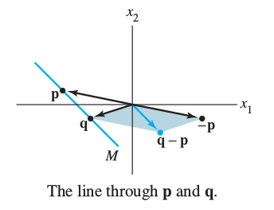

## HW 3

**Due Friday, February 9, 9am**

**Section 1.5.** 6, (14), 16, (22), 24, 26, 34;   
**Section 1.7.** 2, 16, 18, (20), 22, (28), (30), 34, (36), (38);   
**Section 1.8.** 6, 10, 12, 17, 22.

------------------------------------------------------------

### Section 1.5
#### Exercises 6, (14), 16, 22, 24, 26, 34, 38

**1.5.6.**
Write the solution set of the given homogeneous system in
parametric vector form.

$$\begin{align*}
x_1 + 3x_2 -5 x_3 &= 0\\
x_1 + 4x_2 - 8x_3 &= 0\\
-3x_1 - 7x_2 + 9x_3 &= 0
\end{align*}$$

----------------------------------------

**1.5.16.**
Describe the solutions of the following
system in parametric vector form, and provide a geometric
comparison with the solution set in Exercise 6.

$$\begin{align*}
x_1 + 3x_2 -5 x_3 &= 4\\
x_1 + 4x_2 - 8x_3 &= 7\\
-3x_1 - 7x_2 + 9x_3 &= -6
\end{align*}$$

------------------------------------------------------------

**1.5.22.** (Recommended, not required.)
Find a parametric equation of the line $M$
through the vectors
$$\mathbf{p} = \left[\begin{array}{r} -6 \\ 3 \end{array}\right]
 \quad \text{and} \quad \mathbf{q}
\left[\begin{array}{r} 0 \\ -4 \end{array}\right]$$
[Hint: $M$ is parallel to the vector $\mathbf{q}\mathbf{p}$. See the
figure below.]

---------------------------------------

**1.5.24.** Mark each statement True or False. Justify
each answer on the basis of a careful reading of the text.

**a.** If $\mathbf{x}$ is a nontrivial solution of
  $A \mathbf{x} = \mathbf{0}$, then every entry in
  $\mathbf{x}$ is nonzero.

**b.** The equation $\mathbf{x} = x_2 \mathbf{u} + x_3 \mathbf{v}$,
  with $x_2$ and $x_3$ free (and neither $\mathbf{u}$ nor $\mathbf{v}$ a
  multiple of the other), describes a plane through the origin.

**c.** The equation $A \mathbf{x} =  \mathbf{b}$ is homogeneous if the
  zero vector is a solution.

**d.** The effect of adding $\mathbf{p}$ to a vector is to move the vector
  in a direction parallel to $\mathbf{p}$.

---------------------------------------

**1.5.26.** Suppose $A \mathbf{x}= \mathbf{b}$ has a solution. Explain why the solution is
unique precisely when $A \mathbf{x} =\mathbf{0}$ has only the trivial solution.

------------------------------

 **1.5.34.** Given $A = \left[\begin{array}{r} 4 & -6\\-8 & 12\\6 & -9\end{array}\right]$,
find one nontrivial solution of $A \mathbf{x} = \mathbf{0}$ by inspection.  

[Hint: you should not have to reduce the matrix using elementary row operations;
you can just "see" an answer. This is what "by inspection" means.]

-----------------------------------------------

### Section 1.7
#### Exercises 2, 16, 18, (20), 22, (28), (30), 34, (36), (38)

**1.7.2.** Determine if the vectors are linearly independent.
Justify your answer.
$$
\left[\begin{array}{r} 0 \\ 0 \\ 2\end{array}\right],\;
\left[\begin{array}{r} 0 \\ 5 \\ -8\end{array}\right],\;
\left[\begin{array}{r} -3 \\ 4 \\ 1\end{array}\right]
$$

-----------------------

**1.7.16.**  Determine by inspection whether the vectors
are linearly independent. Justify your answer.
$$
\left[\begin{array}{r} 4 \\ -2 \\ 6\end{array}\right],\;
\left[\begin{array}{r} 6 \\ -3 \\ 9\end{array}\right]
$$

-----------------------

**1.7.18.**  Determine by inspection whether the vectors
are linearly independent. Justify your answer.
$$
\left[\begin{array}{r} 4 \\ 4\end{array}\right],\;
\left[\begin{array}{r} -1 \\ 3\end{array}\right],\;
\left[\begin{array}{r} 2 \\ 5\end{array}\right],\;
\left[\begin{array}{r} 8 \\ 1\end{array}\right]
$$

-----------------------

**1.7.20.** (Recommended, not required.)
Determine by inspection whether the vectors are linearly independent.
Justify your answer.
$$
\left[\begin{array}{r} 1 \\ 4 \\ -7\end{array}\right],\;
\left[\begin{array}{r} -2 \\ 5 \\ 3\end{array}\right],\;
\left[\begin{array}{r} 0 \\ 0 \\ 0\end{array}\right]
$$

-----------------------

**1.7.22.** Mark each statement True or False. Justify
each answer on the basis of a careful reading of the text.

**a.** Two vectors are linearly dependent if and only if they lie
on a line through the origin.

**b.** If a set contains fewer vectors than there are entries in the
vectors, then the set is linearly independent.

**c.** If $\mathbf{x}$ and $\mathbf{y}$ are linearly independent, and if $\mathbf{z}$ is in
$\operatorname{Span} \{ \mathbf{x}, \mathbf{y}\}$ , then $\{\mathbf{x}, \mathbf{y}, \mathbf{z}\}$
is linearly dependent.

**d.** If a set in $\mathbb{R}^n$ is linearly dependent, then the set contains
more vectors than there are entries in each vector.

-----------------------

**1.7.28.** (Recommended, not required.)
How many pivot columns must a $5\times 7$ matrix have if its
columns span $\mathbb{R}^5$? Why?

-----------------------

**1.7.30.** (Recommended, not required.)

**a.** Fill in the blank in the following statement: "If A is an
$m \times n$ matrix, then the columns of $A$ are linearly
independent if and only if A has ___ pivot columns.""

**b.** Explain why the statement in **a** is true.

-------------------------------------------------

Each statement in Exercises 34--38 is either true (in all cases)
or false (for at least one example). If false, construct a specific
example to show that the statement is not always true. (Such an
example is called a counterexample to the statement.) If a statement
is true, give a justification. (One specific example cannot explain
why a statement is always true.)

**1.7.34.** If $\mathbf{v}_1, \mathbf{v}_2, \mathbf{v}_3, \mathbf{v}_4$ are in $\mathbb{R}^4$ and
$\mathbf{v}_3 = \mathbf{0}$ then
$\{\mathbf{v}_1, \mathbf{v}_2, \mathbf{v}_3, \mathbf{v}_4\}$
is linearly dependent.

-----------------------

**1.7.36.** (Recommended, not required.)
If $\mathbf{v}_1, \mathbf{v}_2, \mathbf{v}_3, \mathbf{v}_4$ are in $\mathbb{R}^4$ and
$\mathbf{v}_3$ is *not* a linear combination of
$\mathbf{v}_1, \mathbf{v}_2, \mathbf{v}_4$, then
$\{\mathbf{v}_1, \mathbf{v}_2, \mathbf{v}_3, \mathbf{v}_4\}$
is linearly independent.
-----------------------

**1.7.38.** (Recommended, not required.)
If $\mathbf{v}_1, \mathbf{v}_2, \mathbf{v}_3, \mathbf{v}_4$ are linearly independent
vectors in $\mathbb{R}^4$, then $\{\mathbf{v}_1, \mathbf{v}_2, \mathbf{v}_3\}$
is also linearly independent.

------------------------------------------------------------

### Section 1.8
#### Exercises 6, 10, 12, 17, 22

**1.8.6.**
Let
$$A = \left[\begin{array}{r} 1 & -2 & 1\\ 3 & -4 & 5 \\ 0 & 1 & 1\\ -3 & 5 & -4\end{array}\right], \; \mathbf{b} =
\left[\begin{array}{r} 1 \\ 9 \\3 \\ -6\end{array}\right]$$
Let $T$ be defined by $T(\mathbf{x}) = A \mathbf{x}$.
Find a vector $\mathbf{x}$
whose image under $T$ is $\mathbf{b}$, and determine whether $\mathbf{x}$ is unique.

-----------------------

**1.8.10.**
Let $A = \left[\begin{array}{r} 1 & 3 & 9 & 2\\ 1 & 0& 3 & -4 \\
0 & 1 & 2 & 3\\ -2 & 3 & 0 & 5\end{array}\right].$
Find all $\mathbf{x}$ in $\mathbb{R}^4$ that are mapped into the
zero vector by the transformation $\mathbf{x} \mapsto A \mathbf{x}$.

-----------------------

**1.8.12.**
Let
$\mathbf{b} = \left[\begin{array}{r} -1\\3 \\-1 \\4\end{array}\right]$,
and let $A$ be the matrix in Exercise 10. Is $\mathbf{b}$
in the range of the linear transformation $\mathbf{x} \mapsto A \mathbf{x}$?
Why or why not?

-----------------------

**1.8.17.**
Let $T : \mathbb{R}^2 \to \mathbb{R}^2$
be a linear transformation that maps
$\mathbf{u} = \left[\begin{array}{r} 5\\2 \end{array}\right]$
into
$\left[\begin{array}{r} 2\\1\end{array}\right]$,
and maps
$\mathbf{v} = \left[\begin{array}{r} 1\\3\end{array}\right]$
into
$\left[\begin{array}{r} -1\\3\end{array}\right]$.
 Use the fact that $T$ is linear to find the images under $T$ of
 $3 \mathbf{u}$, $2 \mathbf{v}$, and $3 \mathbf{u} + 2 \mathbf{v}$.

-----------------------

**1.8.22.** Mark each statement True or False. Justify
each answer.

**a.** Every matrix transformation is a linear transformation.

**b.** The codomain of the transformation $\mathbf{x} \mapsto A \mathbf{x}$
is the set of all linear combinations of the columns of $A$.

**c.** If
$T : \mathbb{R}^n \to \mathbb{R}^m$
is a linear transformation and if $\mathbf{c}$ is
in $\mathbb{R}^m$, then a uniqueness question is
"Is $\mathbf{c}$ in the range of $T$?”

**d.** A linear transformation preserves the operations of vector
addition and scalar multiplication.

**e.** The superposition principle is a physical description of a
linear transformation.

-----------------------
