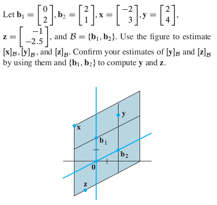

## HW 5

**Due Friday, February 29, 9am**  
**Section 2.3.** 6, 12, 18, 22, 34;   
**Section 2.8.** 6, 10, 18, 22, 24;  
**Section 2.9.** 2, 6, 8, 18. 

---

### Section 2.3
#### Exercises 6, 12, 18, 22, 34

**2.3.6.**
Determine whether the matrix 
$\left[\begin{array}{r}
1 &-5& -4\\
0& 3& 4\\
-3 &6& 0
\end{array}\right]$
is invertible. 
Use as few calculations as possible. Justify your answers.

---------

**2.3.12.**
In this exercise, the matrices are all $n\times n$. Each part of
the exercise is an implication of the form "If 'statement 1',
then 'statement 2'." Mark an implication as True if the truth of
'statement 2' always follows whenever 'statement 1' happens
to be true. An implication is False if there is an instance in
which 'statement 2' is false but 'statement 1' is true. Justify each
answer.

**a.** If there is an 
$n\times n$ matrix $D$ such that $AD = I$, then there
is also an $n\times n$ matrix $C$ such that $CA= I$.     
**b.** If the columns of $A$ are linearly independent, then the
columns of $A$ span $\mathbb{R}^n$.    
**c.** If the equation $A \mathbf{x} = \mathbf{b}$ has at least 
one solution for each $\mathbf{b} \in \mathbb{R}^n$,
then the solution is unique for each $\mathbf{b}$.   
**d.** lf the linear transformation 
$\mathbf{x}\mapsto A \mathbf{x}$ maps $\mathbb{R}^n$ into
$\mathbb{R}^n$, then $A$ has $n$ pivot positions.   
**e.** If there is a $\mathbf{b}$ in $\mathbb{R}^n$ such that the 
equation $A \mathbf{x} = \mathbf{b}$ is
inconsistent, then the transformation 
$\mathbf{x}\mapsto A \mathbf{x}$ is not one-to-one.

-------

**2.3.18.**
If $C$ is a $6\times 6$ matrix and the equation $C\mathbf{x} =\mathbf{v}$ 
is consistent for every $\mathbf{v}$ in $\mathbb{R}^6$, is it possible that, 
for some $\mathbf{v}$, the equation $C \mathbf{x} =\mathbf{v}$
has more than one solution? Why or why not?

--------

**2.3.22.** 
If the equation $H \mathbf{x} =\mathbf{c}$ is inconsistent for some 
$\mathbf{c}$ in $\mathbb{R}^n$, what
can you say about the equation $H \mathbf{x}= \mathbf{0}$? Why?

--------

**2.3.34.**
Suppose $T$ is the linear transformation from $\mathbb{R}^2$ into
$\mathbb{R}^2$ given by $T(x_1, x_2) = (6x_1 - 8x_2, -5x_1+7x_2)$. 
Show that $T$ is invertible and find a formula for $T^{-1}$.

--------

### Section 2.8
#### Exercises 6, 10, 18, 22, 24

**2.8.6.** 
Let $\mathbf{v}_1 = 
\left[\begin{array}{r} 1\\-2\\4\\3\end{array}\right]$,
$\mathbf{v}_2=
\left[\begin{array}{r} 4\\-7\\9\\7\end{array}\right]$,
$\mathbf{v}_3=
\left[\begin{array}{r} 5\\-8\\6\\5\end{array}\right]$,
and
$\mathbf{u} = 
\left[\begin{array}{r} -4\\10\\-7\\-5\end{array}\right]$.
Determine if $\mathbf{u}$ is in the subspace of $\mathbb{R}^4$
generated by $\{\mathbf{v}_1,\mathbf{v}_2,\mathbf{v}_3\}$.

-----------

**2.8.10.**
Let $\mathbf{v}_1 = 
\left[\begin{array}{r} -3\\0\\6\end{array}\right]$,
$\mathbf{v}_2=
\left[\begin{array}{r} -2\\2\\3\end{array}\right]$,
$\mathbf{v}_3=
\left[\begin{array}{r} 0\\-6\\3\end{array}\right]$,
$\mathbf{u}=
\left[\begin{array}{r} -2\\3\\1\end{array}\right]$,
and $A = [\mathbf{v}_1,\mathbf{v}_2,\mathbf{v}_3]$.
Determine if $\mathbf{u}$ is
in $\operatorname{Nul} A$.

-------

**2.8.18.** 
Determine whether the set 
$\left[\begin{array}{r} 1\\1\\-2\end{array}\right],
\left[\begin{array}{r} -5\\-1\\2\end{array}\right],
\left[\begin{array}{r} 7\\0\\-5\end{array}\right]$
is a basis for $\mathbb{R}^2$ or $\mathbb{R}^3$.
Justify your answer.

-------

**2.8.22.** Mark each statement True or False. Justify
each answer.  
**a.** A subset $H$ of $\mathbb{R}^n$ is a subspace if the zero vector is in $H$.   
**b.** Given vectors $\mathbf{v}_1, \dots, \mathbf{v}_p$ in $\mathbb{R}^n$, 
the set of all linear combinations of these vectors is a subspace of $\mathbb{R}^n$.   
**c.** The null space of an $m\times n$ matrix is a subspace of $\mathbb{R}^n$.   
**d.** The column space of a matrix $A$ is the set of solutions of 
  $A\mathbf{x} = \mathbf{b}$.  
**e.** If $B$ is an echelon form of a matrix $A$, then the pivot
columns of $B$ form a basis for $\operatorname{Col} A$.

------

**2.8.24.**
Consider the following echelon form of the matrix $A$: 
$$A = \left[\begin{array}{r} 
-3 & 9 & -2 & -7\\
2 & -6 &4 &8\\
3 &-9& -2& 2\end{array}\right] 
\sim 
\left[\begin{array}{r} 
1 &-3& 6& 9\\
0 &0& 4& 5\\
0 &0 &0 &0
\end{array}\right]$$
Find a basis for $\operatorname{Col}$ A and a basis for $\operatorname{Nul} A$.

-------

### Section 2.9
#### Exercises 2, 6, (8), 18

**2.9.2.**
Find the vector $\mathbf{x}$ determined by the given
coordinate vector 
$[\mathbf{x}]_{\mathcal{B}}$ 
and the given basis $\mathcal{B}$. Illustrate your answer with a figure, 
as in the solution to Practice Problem 2 in the textbook.
\[
\mathcal{B} = \left\{\left[\begin{array}{r} -2\\1\end{array}\right],
\left[\begin{array}{r} 3\\1\end{array}\right]\right\},\;
[\mathbf{x}]_{\mathcal{B}} =  
\left[\begin{array}{r} -1\\3\end{array}\right].
\]

----

**2.9.6.**
Let $\mathcal{B} = \{\mathbf{b}_1, \mathbf{b}_2\}$, where
$\mathbf{b}_1 = \left[\begin{array}{r}-3\\1\\-4\end{array}\right]$ and
$\mathbf{b}_2 = \left[\begin{array}{r} 7\\5\\-6\end{array}\right]$.
The vector $\mathbf{x} = \left[\begin{array}11\\0\\7\end{array}\right]$
belongs to $\mathrm{Span}\{\mathbf{b}_1, \mathbf{b}_2\}$.
Find the $\mathcal{B}$-coordinate representation of $\mathbf{x}$.

-----

**2.9.8.** (recommended)  

**2.9.18.** Mark each statement True or False. Justify
each answer. Here $A$ is an $m\times n$ matrix.  
**a.** If $\mathcal{B}$ is a basis for a subspace $H$, 
then each vector in $H$ can be written in only one way as a 
linear combination of the vectors in $\mathcal{B}$.  
**b.** If $\mathcal{B} =\{\mathbf{v}_1, \dots, \mathbf{v}_p\}$ 
is a basis for a subspace $H$ of $\mathbb{R}^n$, 
then the correspondence $\mathbf{x} \mapsto [\mathbf{x}]_{\mathcal{B}}$ 
makes $H$ look and act the same as $\mathbb{R}^p$.  
**c.** The dimension of $\operatorname{Nul} A$ is the number of 
variables in the equation $A \mathbf{x} = \mathbf{0}$.  
**d.** The dimension of the column space of $A$ is $\operatorname{rank} A$.  
**e.** If $H$ is a $p$-dimensional subspace of $\mathbb{R}^n$, then a linearly
independent set of $p$ vectors in $H$ is a basis for $H$.
