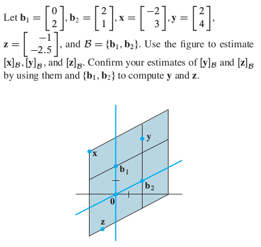

# HW 6 

**DUE: Friday, March 9, 9am**  
**Section 2.9.** 2, 6, 8, 18;   
**Section 3.1:** 10, 28, 32, 38, 40;   
**Section 3.2:** 2, (3).   

### Section 2.9
#### Exercises 2, 6, (8), 18

**2.9.2.**
Find the vector $\mathbf{x}$ determined by the given
coordinate vector 
$[\mathbf{x}]_{\mathcal{B}}$ 
and the given basis $\mathcal{B}$. Illustrate your answer with a figure, 
as in the solution to Practice Problem 2 in the textbook.
\[
\mathcal{B} = \left\{\left[\begin{array}{r} -2\\1\end{array}\right],
\left[\begin{array}{r} 3\\1\end{array}\right]\right\},\;
[\mathbf{x}]_{\mathcal{B}} =  
\left[\begin{array}{r} -1\\3\end{array}\right].
\]

----

**2.9.6.**
Let $\mathcal{B} = \{\mathbf{b}_1, \mathbf{b}_2\}$, where
$\mathbf{b}_1 = \left[\begin{array}{r}-3\\1\\-4\end{array}\right]$ and
$\mathbf{b}_2 = \left[\begin{array}{r}7\\5\\-6\end{array}\right]$.
The vector $\mathbf{x} = \begin{bmatrix}11\\0\\7\end{bmatrix}$
belongs to $\mathrm{Span}\{\mathbf{b}_1, \mathbf{b}_2\}$.
Find the $\mathcal{B}$-coordinate representation of $\mathbf{x}$.

-----

**2.9.8.** (recommended)  

---

**2.9.18.** Mark each statement True or False. Justify
each answer. Here $A$ is an $m\times n$ matrix.  
**a.** If $\mathcal{B}$ is a basis for a subspace $H$, 
then each vector in $H$ can be written in only one way as a 
linear combination of the vectors in $\mathcal{B}$.  
**b.** If $\mathcal{B} =\{\mathbf{v}_1, \dots, \mathbf{v}_p\}$ 
is a basis for a subspace $H$ of $\mathbb{R}^n$, 
then the correspondence $\mathbf{x} \mapsto [\mathbf{x}]_{\mathcal{B}}$ 
makes $H$ look and act the same as $\mathbb{R}^p$.  
**c.** The dimension of $\operatorname{Nul} A$ is the number of 
variables in the equation $A \mathbf{x} = \mathbf{0}$.  
**d.** The dimension of the column space of $A$ is $\operatorname{rank} A$.  
**e.** If $H$ is a $p$-dimensional subspace of $\mathbb{R}^n$, then a linearly
independent set of $p$ vectors in $H$ is a basis for $H$.

---

## Section 3.1 
### Exercises: 10, 28, 32, 38, 40   

**3.1.10.**
Compute the determinant of the following matrix using cofactor 
expansions. At each step, choose a row or column that involves the least
amount of computation.
$$
\left|\begin{array}{r}
~1 & -2 & 5 & 2\\
0 & 0 & 3 & 0\\
2 & -4 & -3 & 5\\
2 & 0 & 3 & 5 
\end{array}\right|
$$

---------------------------------------------------

**3.1.28.**
Compute the determinant of the elementary matrix,
$$
\left[\begin{array}{r}
k &0 &0\\
0 & 1 & 0\\
0 & 0 & 1 \end{array}\right]
$$

---------------------------------------------------

**3.1.32.**
What is the determinant of an elementary scaling matrix with
$k$ on the diagonal?

---------------------------------------------------

**3.1.38.** 
Let $A = \left[\begin{array}{r} a & b \\ c & d \end{array}\right]$ and let $k$ be 
a scalar.  Find a formula that relates $\mathrm{det}( k A)$ to $k$ and $\mathrm{det}A$.

---------------------------------------------------

**3.1.40.**
Let $A$ be an $n\times n$ matrix. Mark each of the following statements True or False.
Justify.

**a.** The cofactor expansion of $\mathrm{det} A$ down a column is equal
   to the cofactor expansion along a row.   
   
**b.** The determinant of a triangular matrix is the sum of the
   entries on the main diagonal.
   
--------------------------------------------------------

## Section 3.2 
### Exercises: 2, (3)

**3.2.2.** 
The following equation illustrates a property of determinants. 
State the property.
$$
\left|\begin{array}{r}
1 & 2 & 2\\
0 & 3 & -4\\
3 & 7 & 4\end{array}\right| = 
\left|\begin{array}{r}
1 & 2 & 2\\
0 & 3 & -4\\
0 & 1 & -2\end{array}\right|
$$

---------------------------------------------------

**3.2.3.** (recommended, not required)
The following equation illustrates a property of determinants. 
State the property.
$$
\left|\begin{array}{r}
3 & -6 & 9\\
3 & 5 & -5\\
1 & 3 & 3\end{array}\right| = 
3\left|\begin{array}{r}
1 & -2 & 3\\
3 & 5 & -5\\
1 & 3 & 3\end{array}\right|
$$

---------------------------------------------------
